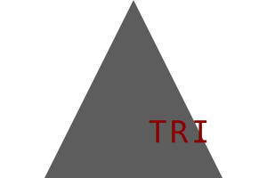

# SIMPLE-LOGO-MAKER

## License

The ISC License simply removes language that would be considered extraneous according to the Berne Convention. The ISC License is considered equivalent to the Simplified (2-Clause) BSD License but with more concise language.

## Description
This simple logo maker app is designed to provide an easy method of creating a simple 1-3 letter logo .svg file.
Follow the usage directions below and you'll have your new logo in no time.

Example outputs:

## Table of Contents
- [Installation](#installation)
- [Usage](#usage)
- [License](#license)
- [Tests](#tests)
- [Questions](#questions)

## Installation
- This app requires node.js and packages: inquirer, is-css3-color and jest

## Usage
- Type into your CLI "node index.js" to get started and follow the prompts. Your output file will be in the dist/ directory.
- For color selections you can use css keywords or hex colors

- Video example: https://youtu.be/BwDRkLhxhdM

## Tests
- Type "npm test" in your CLI to run through the jest tests.

## Questions
- For any questions or concerns, please reach out to me through the following contact information:

- Github: [mHammy](https://github.com/mHammy)
- Email: matthewrhamiltonis@gmail.com
